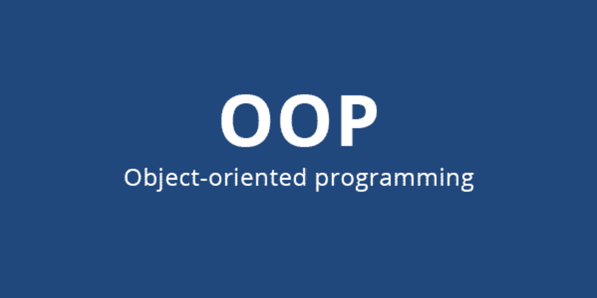
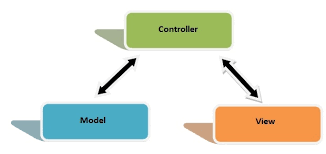

<!DOCTYPE html>
<html lang="pt-br">

<head>
    <meta charset="UTF-8">
    <meta name="viewport" content="width=device-width, initial-scale=1.0">

</head>

<body style="text-align:justify">
    

        <h1> Sistema conta azul</h1>
        
O sistema deriva-se de um <i>RP</i> completo para empresas o sistema contem em sua plataforma um sistema de
            login, onde detecta o que o funcionario pode acessar no sistema
            ou seja cada pessoa cadastrada no sistema terá uma ou mais funções para serem executadas, podendo ser de
            administradores a simples usuários de vendas
        

        
Podendo também criar novos usuários permissões e grupo de usuários que podem ter acesso ao sistema.
            Será um sistema privado que para ter acesso as funcionalidades o usuário deve está totamente cadastrado por
            um dos administradores do sistema ou por alguém que tenha alguma autorização para efetuar o cadastramento do
            mesmo
        

        
Sistema web conta azul que foi refeito em termos acadêmicos pela plataforma B7web é desenvolvido em linguagem
            PHP orientada a objetos
            métodos e bibliotecas da linguagem PHP e dos padrões do banco de dados
        

    

     
    <h2>Utilizado para desenvolver o projeto foram: </h2>
    

        <h3>Ferramentas Utilizadas em front-end</h3>
        

        <ul>
             &nbsp; <strong
                style='text-align:justify;'>HTML 5 </strong> 
             
            &nbsp; <strong
                style='text-align:justify;'>CSS 3 
                 
                &nbsp;<strong
                    style='text-align:justify;'>JS </strong> 
                 
                &nbsp;<strong
                    style='text-align:justify;'>Jquery </strong> 
                 
        </ul>
    

    

        <h3>Linguagem feita em seu Backend </h3>
        

        <ul>
            &nbsp;<strong style='text-align:justify;'>PHP na versão
                7.4 </strong> 
        </ul>
    

    

        <h3>Servidor Utilizado </h3>
        

        <ul>
             &nbsp;<strong
                style='text-align:justify'>Xampp</strong> 
        </ul>
    

    

        <h3>Banco de dados </h3>
        

        <ul>
             &nbsp;<strong
                style='text-align:justify;'>MYSQL</strong> 
        </ul>
    

    

        <h3>Softwares e utilitários </h3>
        

        <ul>
            
            &nbsp;<strong style='text-align:justify;'>Mysql Workbench </strong> 
             
             &nbsp;<strong
                style='text-align:justify;'> PHPMYADMIN </strong> 
             
        </ul>
         
    

    

        <h3>Bibliotecas PHP para configuração do projeto </h3>
        

        <ul>
             &nbsp;<strong
                style='text-align:justify;'>PDO</strong> 
             
             &nbsp;<strong
                style='text-align:justify;'>POO</strong> 
             
             &nbsp;<strong
                style='text-align:justify;'>COMPOSER</strong> 
             
             &nbsp;<strong
                style='text-align:justify;'>MPDF</strong> 
             
             &nbsp;<strong
                style='text-align:justify;'>PHPMAIL</strong> 
        </ul>
         
    

    

        <h3>Arquitetura </h3>
        

        <ul>
             &nbsp;<strong
                style='text-align:justify;'> MVC </strong> 
        </ul>
    

    

        <h3>Editor de código </h3>
        

        <ul>
             &nbsp;<strong
                style='text-align:justify;'> Visual Studio Code </strong> 
        </ul>
    

</body>

</html>